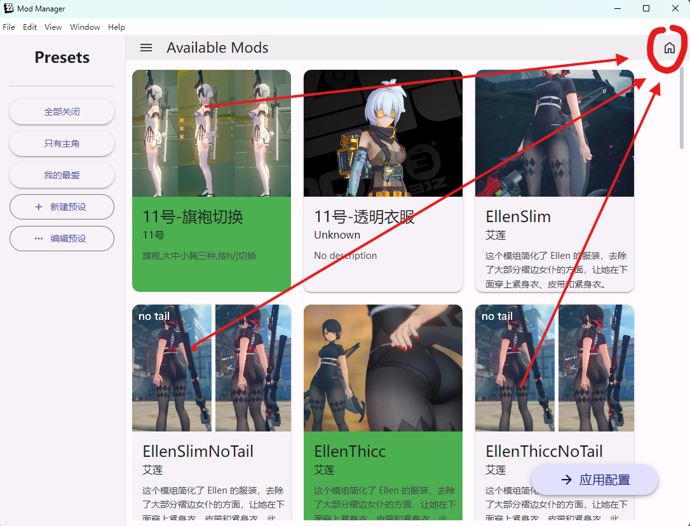
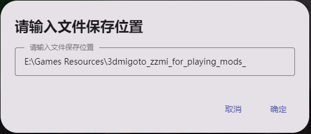

# Mods Manager for 3dmigoto<br>——3dmigoto的插件管理工具

## Project Introduction

This is a convenient plugin management tool designed to manage mods for 3dmigoto through a beautiful GUI interface.

The tool uses the sober library to implement a Material You-style interface.


## Feature List

1. Read the optional mod list from the `modResourceBackpack` folder (each folder represents a mod).
2. Select which mods to enable through a beautiful visual page.
3. After clicking the `Apply` button, copy the selected mods to the `3dmigoto/Mods` folder.
4. Click `Create Preset` to create presets, click to switch between presets, and click `Apply` again to apply the preset.

## Installation Steps
### Download from Release
There are two versions on the release page, one is the installer version and the other is the loose file version. The installer version is an exe file, and the loose file version is a folder that contains all the files.

It is recommended to use the loose file version as it loads faster.

1. Download the latest version of the installer or loose files.
2. Extract the files.
3. Run `ZZZmod管理器-1.0.0 Setup.exe` or `ZZZmod管理器.exe`.

### Compile from Source Code
1. Clone this repository to your local machine:
    ```bash
    git clone https://github.com/XiaoLinXiaoZhu/Mods-Manager-for-3Dmigoto.git
    ```
2. Enter the project directory:
    ```bash
    cd Mods-Manager-for-3Dmigoto
    ```
3. Install dependencies:
    ```bash
    npm install electron@latest
    npm install @soberjs/core
    ```
4. Start the project:
    ```bash
    npm run start
    ```
5. Package the project: Install electron forge to package the project
    ```bash
    npm install -g electron-forge
    electron-forge make
    ```
    The packaged files will be in the out folder.

## Getting Started

1. After launching the application, the interface will display all the mods in the `modResourceBackpack` folder. When using it for the first time, you need to specify the root directory path of the `modResourceBackpack` folder.For example, if the folder structure is as follows:
    ```
    rootdir
    ├── modResourceBackpack
    │   ├── mod1
    │   ├── mod2
    │   ├── mod3
    │   └── ...
    ├── 3dmigoto
    │   ├── Mods
    │   ├── 3dmigoto.exe
    │   └── ...
    └── presets
        ├── preset1
        ├── preset2
        ├── preset3
        └── ...
    ```
    Then the specified folder path should be the root directory `rootdir` of the `modResourceBackpack` folder.

1. Simply install the mods into the `modResourceBackpack` folder. You may need to add a mod.json file for each mod to display the mod's name and description in the manager. The format of the mod.json file is as follows:
    ```json
    {
    "character": "Anby",
    "description": "This is a description of my mod.",
    "imagePath": "preview.png"
    }
    ```

> The tool also provides autog.bat to help generate mod.json. Of course, you don't need to set it for each mod. Just ensure the readability of the folder name and place an image under the mod folder to achieve a better visual effect:
> 
> When loading the mod list, the displayed image will be obtained according to the following priority:
> 1. The imagePath field in mod.json
> 2. The first image named preview under the mod folder
> 3. The first image under the mod folder
> 4. Default image


## Usage Instructions

1. Click on a mod card to select or deselect the mod.
2. Click the `Apply` button to apply the changes.
3. Click the `Create Preset` button to create presets.
4. Click the `Preset` button to switch between presets.
5. Click the `Manage Presets` button to manage presets.

## Known Issues

None.

## Technology Stack

- Electron
- [sober library](https://soberjs.com/)
- Material You style

## Future Plans


## Contribution Guidelines

Welcome any form of contribution! Please follow these steps:

1. Fork this repository.
2. Create a new branch:
    ```bash
    git checkout -b feature/your-feature-name
    ```
3. Commit your changes:
    ```bash
    git commit -m 'Add some feature'
    ```
4. Push to the branch:
    ```bash
    git push origin feature/your-feature-name
    ```
5. Create a Pull Request.

## Version History
### What's new in version 1.5:
#### New functions:
- Added theme selection function (dark theme is recommended, I imitated it according to the design style of zzz)  
-  Added a button to close the window, which is placed in the bottom left corner  
-  Added text descriptions for icon buttons  
-  The mod files in your mods folder will now never be delete now, and a warning window and action selection will pop up in case of conflicts  

#### Better visuals :
- The color scheme is modeled after the ZZZ design  
-  Optimized the display effect of filtering by role
-  Added a very, very good display effect of mod cards, which will have corresponding animations and display effects when they are selected or unselected.
-  Added a highlight when a preset is selected  
#### Bugs fixed:
-  When program find a folder in the Mods folder that is not being managed, a warning window and action options will appear, and you can choose what to do with the mods that are not managed (ignore: ignore, the file will not be deleted or moved; Move to ModResourceBackpack: Move the mod to the modResourceBackpack folder for program management  
-  Presets are automatically saved when you change the choice of mod cards  now.
- Some of the text has not been replaced with the translated text  

## License

This project is open source under the MIT License. For more information, see the [LICENSE](./LICENSE) file.
