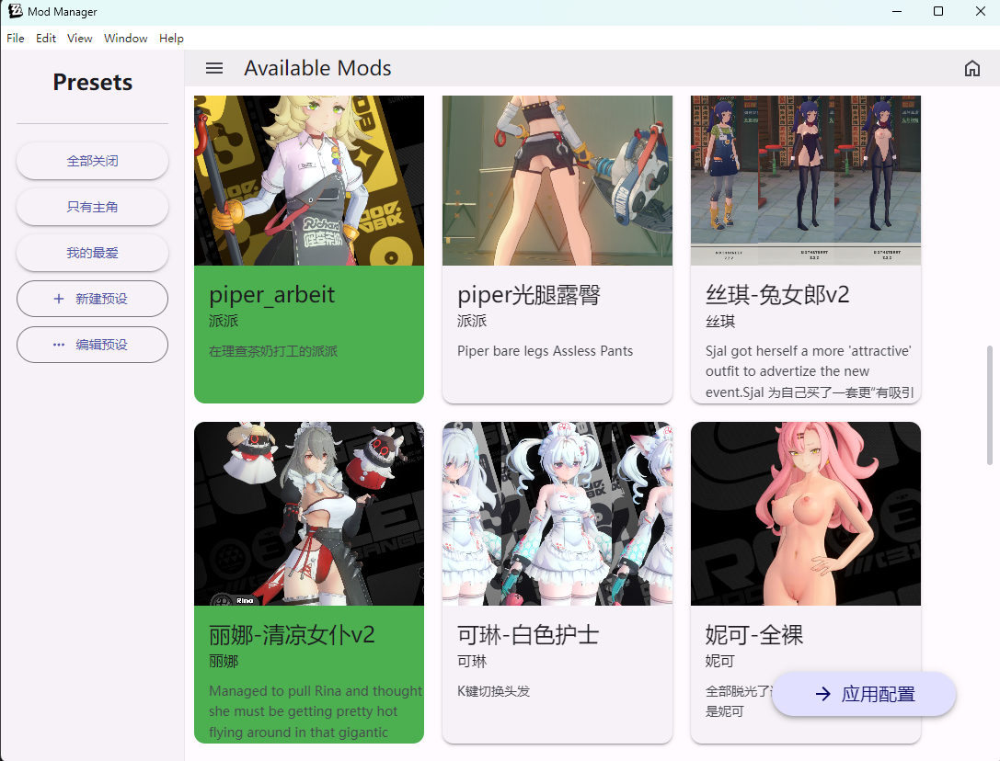
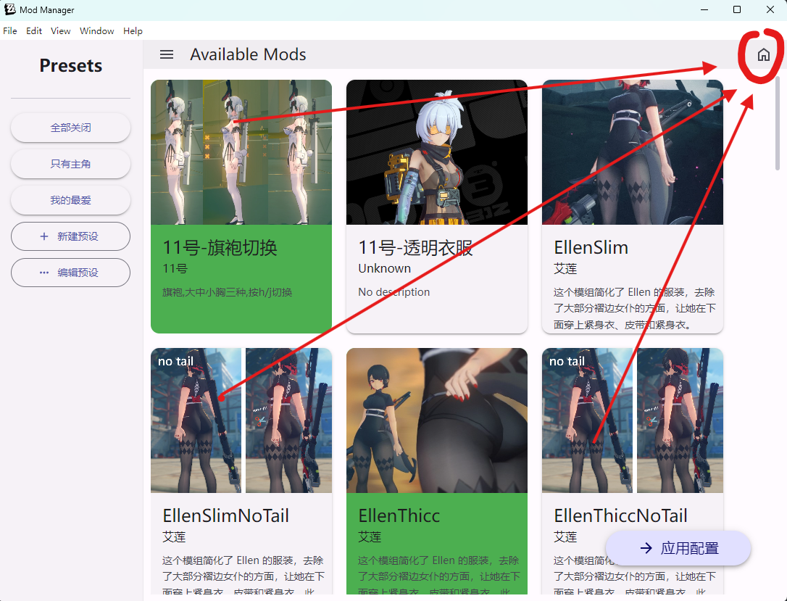
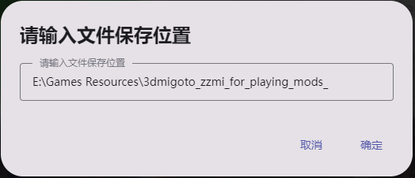
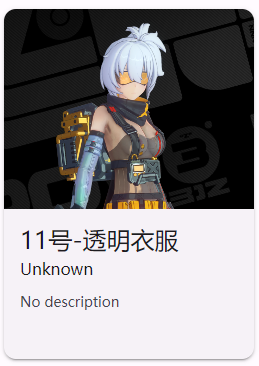

# Mods Manager for 3dmigoto<br>——3dmigoto的插件管理工具

english version: [readme-en.md](./readme-en.md)

## 项目简介

这是一个便捷的插件管理工具，旨在通过一个美观的GUI界面来管理3dmigoto的mods。

该工具利用sober库实现了Material You风格的界面。


## 功能列表

1. 从 `modResourceBackpack` 文件夹内读取可选mod列表（每个文件夹即为一个mod）。
2. 通过一个美观的可视化页面，选择开启哪些mod。
3. 点击 `Apply` 按钮后，根据选择的mod，将其复制到 `3dmigoto/Mods` 文件夹中。
4. 点击 `创建预设` 可以创建预设，点击可以在预设之间切换，并且再次点击 `Apply` 以应用预设。

## 安装步骤
### 从 release 下载
release页面里面有两个版本，一个是安装包版本，一个是松散文件版本。安装包版本是一个exe文件，松散文件版本是一个文件夹，里面包含了所有的文件。

建议使用松散文件版本，因为这样加载速度会更快。

1. 下载最新版本的安装包或者松散文件。
2. 解压文件。
3. 运行 `ZZZmod管理器-1.0.0 Setup.exe` 或者 `ZZZmod管理器.exe`。

### 从 源码 编译
1. 克隆此仓库到本地：
    ```bash
    git clone https://github.com/XiaoLinXiaoZhu/Mods-Manager-for-3Dmigoto.git
    ```
2. 进入项目目录：
    ```bash
    cd Mods-Manager-for-3Dmigoto
    ```
3. 安装依赖：
    ```bash
    npm install electron@latest
    npm install @soberjs/core
    ```
4. 启动项目：
    ```bash
    npm run start
    ```
5. 打包项目：安装electron forge 来打包项目
    ```bash
    npm install -g electron-forge
    electron-forge make
    ```
    打包后的文件在out文件夹中
    
## 开始使用

1. 启动应用后，界面会显示 `modResourceBackpack` 文件夹中的所有mod，首次使用时，需要指定 `modResourceBackpack` 文件夹根目录的路径。比如：文件夹结构如下：
    ```
    rootdir
    ├── modResourceBackpack
    │   ├── mod1
    │   ├── mod2
    │   ├── mod3
    │   └── ...
    ├── 3dmigoto
    │   ├── Mods
    │   ├── 3dmigoto.exe
    │   └── ...
    └── presets
        ├── preset1
        ├── preset2
        ├── preset3
        └── ...
    ```
    那么指定的文件夹的路径应为 `modResourceBackpack` 文件夹的根目录 `rootdir`。

1. 将mod安装至 `modResourceBackpack` 文件夹中即可，你可能需要为每个mod增加一个 mod.json 文件，以便在管理器中显示mod的名称和描述。mod.json文件的格式如下：
    ```json
    {
    "character": "Anby",
    "description": "This is a description of my mod.",
    "imagePath": "preview.png"
    }
    ```

> 工具里面也提供了 autog.bat 来帮助生成 mod.json，当然你也不必每个mod都设置，只需要保证文件夹名称的可读性，并在mod文件夹下防止一张图片即可达到比较好的视觉效果:
> 
> 当加载mod列表的时候，会按照以下优先级获取显示的图片：
> 1. mod.json 中的 imagePath 字段
> 2. mod文件夹下的第一张 名称为 preview 的图片
> 3. mod文件夹下的第一张图片
> 4. 默认图片


## 使用说明

1. 单击mod的卡片即可选择或取消选择mod。
2. 点击 `Apply` `应用配置` 按钮以应用更改。
3. 点击 `创建预设` 按钮以创建预设。
4. 点击 `预设` 按钮以切换预设。
5. 点击 `管理预设` 按钮以管理预设。

## 已知问题
- 首次启动时，会出现 所有的mod都被选中/没被选中 的情况，这是因为没有选择 指定的预设。随便单击一个预设即可解决。
- 有时候会出现 无法读取mod列表 的情况，这是因为没有指定 `modResourceBackpack` 文件夹的路径。重新指定即可解决。

## 技术栈

- Electron
- [sober库](https://soberjs.com/)
- Material You 风格

## 后续计划


# 需要修复的bug

~~1. 上方的全部按钮的英文~~
~~2. 分类页面的布局优化~~
3. 预设保存检测
4. 手动移动和自动移动的更详细的说明
5. 取消首次打开软件时，自动应用配置。
6. 如果mod文件夹的文件夹在modResource里面不存在，则不应该删除，并且弹出提示框。


## 贡献指南

欢迎任何形式的贡献！请遵循以下步骤：

1. Fork 此仓库。
2. 创建一个新的分支：
    ```bash
    git checkout -b feature/your-feature-name
    ```
3. 提交你的更改：
    ```bash
    git commit -m 'Add some feature'
    ```
4. 推送到分支：
    ```bash
    git push origin feature/your-feature-name
    ```
5. 创建一个Pull Request。

## 许可证

此项目基于MIT许可证开源。详细信息请参阅 [LICENSE](./LICENSE) 文件。